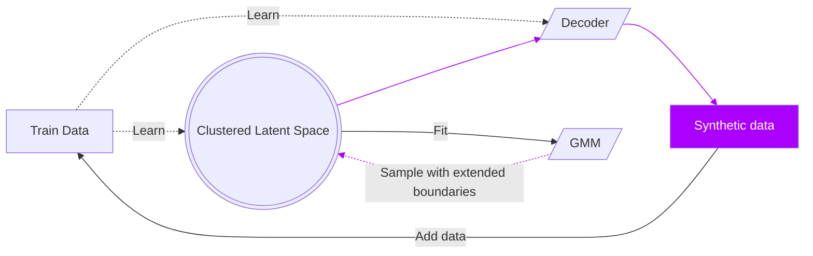

# Latent Space TS Augmentation
 
 This repository aims at implementing a simple and efficient method to augment time series data using a latent space. The method is based on the idea of using a variational autoencoder (VAE) to learn a latent space representation of the time series data. The latent space is then used to generate new time series data by sampling from the latent space.

 The method is implemented using :
    - [Python 3.12.3](https://www.python.org/)
    - [PyTorch](https://pytorch.org/)
    - [NumPy](https://numpy.org/)
    - [Pandas](https://pandas.pydata.org/)


## Results and comparisons

We computed the results for all UCR Archive datasets for both FCN and Resnet models.
We performed a comparison with the following methods:
- FAA
- LA
- Diffusion
- TTSGAN
- ASCENSION
- VaDE
- FCNemb
- ImagenTime
- Diffusion-TS
- KoVAE

### Fully converted Network Classification
Can be found in the `comparison_results/FCN_all.csv` file.

| dataset | baseline | FAA | LA  | Diffusion | TTSGAN | ASCENSION | VaDE | FCNemb | ImagenTime | Diffusion-TS | KoVAE |
| --- | --- | --- | --- | --- | --- | --- | --- | --- | --- | --- | --- |
| ACSF1 | 0.87 | 0.65 | 0.87 | 0.7985611510791367 | 0.84 | 0.83 | 0.81 | 0.87 | 0.84 | 0.7621616202219429 | 0.18 |
| Adiac | 0.7519181585677749 | 0.1764705882352941 | 0.7365728900255755 | 0.5913461538461539 | 0.7595907928388747 | 0.7647058823529411 | 0.6061381074168798 | 0.7723785166240409 | 0.7084398976982097 | 0.6097272676641327 | 0.0741687979539642 |
| ArrowHead | 0.7942857142857143 | 0.56 | 0.84 | 0.542319749216301 | 0.7942857142857143 | 0.7828571428571428 | 0.8 | 0.84 | 0.76 | 0.6703436212383156 | 0.6114285714285714 |
| BME | 0.6733333333333333 | 0.5133333333333333 | 0.6866666666666666 | 0.2953586497890295 | 0.7066666666666667 | 0.68 | 0.5933333333333334 | 0.7266666666666667 | 0.6866666666666666 | 0.6110612721111963 | 0.4933333333333333 |
| Beef | 0.7 | 0.3666666666666666 | 0.7 | 0.7523333333333333 | 0.6625974025974026 | 0.9000000357627869 | 0.6333333333333333 | 0.7 | 0.6666666666666666 | 0.7156979475839842 | 0.3 |
| BeetleFly | 0.9 | 0.8 | 0.9 | 1.0 | 0.9 | 0.9 | 0.95 | 0.9 | 0.95 | 0.5484354266639617 | 0.85 |
| BirdChicken | 0.75 | 0.9 | 0.75 | 0.6 | 0.95 | 0.8 | 1.0 | 0.95 | 0.75 | 0.5452587376358822 | 0.5 |
| CBF | 0.9766666666666668 | 0.9866666666666668 | 0.9677777777777776 | 0.6688311688311688 | 0.98 | 0.9733333333333334 | 0.9277777777777778 | 0.9677777777777776 | 0.9611111111111112 | 0.9980882974481584 | 0.8555555555555555 |
| Car | 0.5166666666666667 | 0.5 | 0.5666666666666667 | 0.9904761904761904 | 0.5833333333333334 | 0.5666666666666667 | 0.6166666666666667 | 0.6333333333333333 | 0.65 | 0.5322938262759135 | 0.35 |
| ChlorineConcentration | 0.8049479166666667 | 0.55546875 | 0.8013020833333333 | 0.7314285714285714 | 0.8080729166666667 | 0.80625 | 0.8028645833333333 | 0.8013020833333333 | 0.7986979166666667 | 0.6926289799094009 | 0.5338541666666666 |
| CinCECGTorso | 0.8188405797101449 | 0.6456521739130435 | 0.7731884057971015 | 0.9201331114808652 | 0.6492753623188405 | 0.8231884057971014 | 0.7159420289855073 | 0.7963768115942029 | 0.7326086956521739 | 0.436174336639857 | 0.5130434782608696 |
| Coffee | 0.8214285714285714 | 1.0 | 0.8214285714285714 | 0.7075606276747504 | 0.8571428571428571 | 0.8571428571428571 | 0.8214285714285714 | 0.9285714285714286 | 0.75 | 0.7584029570351024 | 0.8571428571428571 |
| Computers | 0.736 | 0.724 | 0.684 | 0.8263403263403264 | 0.752 | 0.835 | 0.7 | 0.684 | 0.704 | 0.7319725479525064 | 0.5 |
| Crop | 0.7600595238095238 | 0.6775 | 0.7568452380952381 | 0.83 | 0.7583928571428571 | 0.7595833333333334 | 0.7559523809523809 | 0.759702380952381 | 0.7551190476190476 | 0.7983938800208561 | 0.2800595238095238 |
| DistalPhalanxOutlineAgeGroup | 0.7553956834532374 | 0.7482014388489209 | 0.7410071942446043 | 0.6296296296296297 | 0.7697841726618705 | 0.8129496402877698 | 0.8057553956834532 | 0.8057553956834532 | 0.762589928057554 | 0.8068480109515405 | 0.5611510791366906 |
| DistalPhalanxOutlineCorrect | 0.782608695652174 | 0.7608695652173914 | 0.7934782608695652 | 0.5568181818181818 | 0.7862318840579711 | 0.7934782608695652 | 0.7934782608695652 | 0.7971014492753623 | 0.7971014492753623 | 0.8418527940733754 | 0.6557971014492754 |
| DistalPhalanxTW | 0.7122302158273381 | 0.6834532374100719 | 0.7194244604316546 | 0.9333333333333332 | 0.7194244604316546 | 0.7266187050359713 | 0.7482014388489209 | 0.7338129496402878 | 0.697841726618705 | 0.7543603808993733 | 0.39568345323741 |
| ECG200 | 0.89 | 0.8 | 0.87 | 0.8551219512195122 | 0.91 | 0.89 | 0.84 | 0.89 | 0.88 | 0.8422389892613541 | 0.79 |
| ECG5000 | 0.9402222222222222 | 0.9204444444444444 | 0.9411111111111112 | 0.9246231155778896 | 0.94 | 0.9408888888888888 | 0.9402222222222222 | 0.9411111111111112 | 0.9397777777777778 | 0.9867737546304892 | 0.8202222222222222 |
| ECGFiveDays | 0.8571428571428571 | 0.6480836236933798 | 0.7770034843205574 | 0.6476190476190476 | 0.8199767711962834 | 0.7816492450638792 | 0.8606271777003485 | 0.8606271777003485 | 0.7584204413472706 | 0.662738836108978 | 0.5435540069686411 |
| EOGHorizontalSignal | 0.5552486187845304 | 0.3176795580110497 | 0.4889502762430939 | 0.3757142857142857 | 0.1712707182320442 | 0.5414364640883977 | 0.4392265193370165 | 0.5276243093922652 | 0.4834254143646408 | 0.3945116417751465 | 0.1657458563535911 |
| EOGVerticalSignal | 0.4116022099447514 | 0.2265193370165746 | 0.4392265193370165 | 0.7691233947515355 | 0.1519337016574585 | 0.4005524861878453 | 0.3011049723756906 | 0.4392265193370165 | 0.3867403314917127 | 0.2987778121798394 | 0.143646408839779 |
| Earthquakes | 0.7769784172661871 | 0.7482014388489209 | 0.7697841726618705 | 0.7050359712230215 | 0.7697841726618705 | 0.7769784172661871 | 0.7769784172661871 | 0.7769784172661871 | 0.7769784172661871 | 0.7987245143876172 | 0.7697841726618705 |
| ElectricDevices | 0.7184541563999481 | 0.6210608222020491 | 0.7101543249902736 | 0.7373417721518988 | 0.6660614706263779 | 0.7196213201919336 | 0.7301257943198028 | 0.7215665931785761 | 0.7023732330437038 | 0.7462098915001657 | 0.3817922448450266 |
| EthanolLevel | 0.456 | 0.248 | 0.46 | 0.5032467532467533 | 0.48 | 0.8140000104904175 | 0.45 | 0.468 | 0.41 | 0.3716324482145682 | 0.248 |
| FaceAll | 0.9437869822485208 | 0.8609467455621301 | 0.908284023668639 | 0.972972972972973 | 0.8301775147928994 | 0.9224852071005916 | 0.8372781065088757 | 0.9088757396449704 | 0.8568047337278106 | 0.8009465029751655 | 0.0502958579881656 |
| FaceFour | 0.8295454545454546 | 0.4545454545454545 | 0.8295454545454546 | 0.8698083067092651 | 0.7159090909090909 | 0.8068181818181818 | 0.7613636363636364 | 0.8295454545454546 | 0.8295454545454546 | 0.4674781264690717 | 0.4659090909090909 |
| FacesUCR | 0.8639024390243902 | 0.5478048780487805 | 0.848780487804878 | 0.8007246376811594 | 0.8565853658536585 | 0.8726829268292683 | 0.8121951219512196 | 0.8551219512195122 | 0.8634146341463415 | 0.5355620747807022 | 0.1048780487804878 |
| Fish | 0.7485714285714286 | 0.4971428571428571 | 0.6571428571428571 | 0.6887213847012842 | 0.7142857142857143 | 0.7028571428571428 | 0.7485714285714286 | 0.7485714285714286 | 0.6742857142857143 | 0.462866526770853 | 0.1828571428571428 |
| FordA | 0.9030303030303032 | 0.8946969696969697 | 0.8962121212121212 | 0.7971014492753623 | 0.9022727272727272 | 0.9007575757575758 | 0.8992424242424243 | 0.9 | 0.9 | 0.95185604022955 | 0.7848484848484848 |
| FordB | 0.7716049382716049 | 0.6777777777777778 | 0.774074074074074 | 0.6675041876046901 | 0.7728395061728395 | 0.7716049382716049 | 0.7691358024691358 | 0.774074074074074 | 0.7654320987654321 | 0.8166070743714398 | 0.6555555555555556 |
| FreezerRegularTrain | 0.9880701754385964 | 0.7680701754385965 | 0.990877192982456 | 0.275 | 0.9863157894736844 | 0.9873684210526316 | 0.9901754385964912 | 0.992280701754386 | 0.9901754385964912 | 0.8447232950736385 | 0.7810526315789473 |
| FreezerSmallTrain | 0.8157894736842105 | 0.7603508771929824 | 0.8414035087719298 | 0.8195121951219512 | 0.7592982456140351 | 0.8333333730697632 | 0.8880701754385965 | 0.8414035087719298 | 0.771578947368421 | 0.810961251509132 | 0.6217543859649123 |
| GunPoint | 0.98 | 0.9266666666666666 | 0.98 | 0.3214285714285714 | 0.98 | 0.9866666666666668 | 0.96 | 0.9866666666666668 | 0.9666666666666668 | 0.906084051103963 | 0.5066666666666667 |
| GunPointAgeSpan | 0.971518987341772 | 0.7753164556962026 | 0.9746835443037974 | 0.9104 | 0.509493670886076 | 0.9588607594936708 | 0.9556962025316456 | 0.9746835443037974 | 0.9620253164556962 | 0.8935896083251934 | 0.5063291139240507 |
| GunPointMaleVersusFemale | 0.9873417721518988 | 0.939873417721519 | 0.9936708860759492 | 1.0 | 0.5253164556962026 | 0.990506329113924 | 0.990506329113924 | 0.9936708860759492 | 0.9841772151898734 | 0.9588506671412867 | 0.5253164556962026 |
| GunPointOldVersusYoung | 1.0 | 1.0 | 1.0 | 0.85 | 0.9968253968253968 | 1.0 | 1.0 | 1.0 | 1.0 | 1.0 | 0.5238095238095238 |
| Ham | 0.6857142857142857 | 0.7333333333333333 | 0.6666666666666666 | 0.7953964194373402 | 0.6857142857142857 | 0.6952380952380952 | 0.6761904761904762 | 0.7047619047619048 | 0.7142857142857143 | 0.6963121767678784 | 0.4857142857142857 |
| HandOutlines | 0.9108108108108108 | 0.6405405405405405 | 0.8864864864864865 | 0.7771428571428571 | 0.7810075769543 | 0.911024877896233 | 0.9108108108108108 | 0.8972972972972973 | 0.8972972972972973 | 0.8473064900186331 | 0.4135135135135135 |
| Haptics | 0.4707792207792208 | 0.3019480519480519 | 0.4512987012987013 | 0.7 | 0.4448051948051948 | 0.4577922077922078 | 0.4902597402597403 | 0.5227272727272727 | 0.461038961038961 | 0.3800434757152356 | 0.2175324675324675 |
| Herring | 0.625 | 0.59375 | 0.625 | 0.9722222222222222 | 0.609375 | 0.609375 | 0.625 | 0.65625 | 0.609375 | 0.6426865966471172 | 0.59375 |
| HouseTwenty | 0.9411764705882352 | 0.907563025210084 | 0.9663865546218487 | 0.4866666666666667 | 0.5798319327731093 | 0.957983193277311 | 0.9327731092436976 | 0.9663865546218487 | 0.9663865546218487 | 0.9170289684419368 | 0.5798319327731093 |
| InlineSkate | 0.3581818181818181 | 0.1709090909090909 | 0.3818181818181818 | 0.7857142857142857 | 0.2472727272727272 | 0.3981818181818182 | 0.3309090909090909 | 0.3818181818181818 | 0.2509090909090909 | 0.2414741015911343 | 0.1636363636363636 |
| InsectEPGRegularTrain | 1.0 | 1.0 | 1.0 | 0.8044270833333333 | 1.0 | 1.0 | 1.0 | 1.0 | 1.0 | 1.0 | 1.0 |
| InsectEPGSmallTrain | 1.0 | 1.0 | 1.0 | 0.9737609329446064 | 1.0 | 1.0 | 1.0 | 1.0 | 1.0 | 1.0 | 1.0 |
| InsectWingbeatSound | 0.509090909090909 | 0.3111111111111111 | 0.4888888888888889 | 0.7086956521739131 | 0.4853535353535353 | 0.4969696969696969 | 0.4606060606060606 | 0.4969696969696969 | 0.4590909090909091 | 0.4697845612381922 | 0.2272727272727272 |
| ItalyPowerDemand | 0.9659863945578232 | 0.9552964042759962 | 0.9611273080660836 | 0.692 | 0.9504373177842566 | 0.966958211856171 | 0.9689018464528668 | 0.9718172983479106 | 0.9689018464528668 | 1.0 | 0.9251700680272108 |
| LargeKitchenAppliances | 0.856 | 0.7066666666666667 | 0.824 | 0.6666666666666666 | 0.8506666666666667 | 0.8613333333333333 | 0.8426666666666667 | 0.8293333333333334 | 0.8133333333333334 | 0.8637902945008947 | 0.616 |
| Lightning2 | 0.7704918032786885 | 0.6557377049180327 | 0.7868852459016393 | 0.6794871794871795 | 0.7213114754098361 | 0.7704918032786885 | 0.7540983606557377 | 0.8360655737704918 | 0.7540983606557377 | 0.6892305236730091 | 0.4590163934426229 |
| Lightning7 | 0.726027397260274 | 0.4794520547945205 | 0.7534246575342466 | 0.6615384615384615 | 0.7808219178082192 | 0.726027397260274 | 0.6438356164383562 | 0.7808219178082192 | 0.7671232876712328 | 0.4768466693424601 | 0.2876712328767123 |
| Mallat | 0.8251599147121536 | 0.2575692963752665 | 0.9194029850746268 | 0.7594642857142857 | 0.8281449893390191 | 0.9321961620469084 | 0.5437100213219617 | 0.9356076759061832 | 0.913006396588486 | 0.4307636221239131 | 0.2498933901918976 |
| Meat | 0.9 | 0.3333333333333333 | 0.9 | 0.934640522875817 | 0.9 | 0.9166666666666666 | 0.9166666666666666 | 0.9166666666666666 | 0.8666666666666667 | 0.7185013711707944 | 0.3333333333333333 |
| MedicalImages | 0.756578947368421 | 0.5355263157894737 | 0.7513157894736842 | 0.6014492753623188 | 0.7473684210526316 | 0.7447368421052631 | 0.7552631578947369 | 0.7592105263157894 | 0.7394736842105263 | 0.6424221193015734 | 0.5736842105263158 |
| MiddlePhalanxOutlineAgeGroup | 0.6428571428571429 | 0.6428571428571429 | 0.6623376623376623 | 0.7769784172661871 | 0.6493506493506493 | 0.6493506493506493 | 0.6493506493506493 | 0.6623376623376623 | 0.6558441558441559 | 0.6855836682189361 | 0.2987012987012987 |
| MiddlePhalanxOutlineCorrect | 0.8075601374570447 | 0.5738831615120275 | 0.7903780068728522 | 0.91 | 0.8075601374570447 | 0.7972508591065293 | 0.8075601374570447 | 0.8041237113402062 | 0.8109965635738832 | 0.8344306685239645 | 0.7079037800687286 |
| MiddlePhalanxTW | 0.6233766233766234 | 0.5584415584415584 | 0.6233766233766234 | 0.9397777777777778 | 0.6038961038961039 | 0.6168831168831169 | 0.6103896103896104 | 0.6298701298701299 | 0.6233766233766234 | 0.660892584381954 | 0.3896103896103896 |
| MixedShapesRegularTrain | 0.9397938144329896 | 0.8301030927835051 | 0.9311340206185568 | 0.7862950058072009 | 0.8647422680412371 | 0.9381443298969072 | 0.9323711340206186 | 0.9311340206185568 | 0.91340206185567 | 0.944917082608786 | 0.4956701030927835 |
| MixedShapesSmallTrain | 0.8725773195876289 | 0.8131958762886597 | 0.8630927835051546 | 0.5165745856353591 | 0.7002061855670103 | 0.8746391752577319 | 0.88 | 0.8630927835051546 | 0.828041237113402 | 0.4888963539541461 | 0.1888659793814433 |
| MoteStrain | 0.884185303514377 | 0.865814696485623 | 0.902555910543131 | 0.3701657458563536 | 0.8921725239616614 | 0.8865814696485623 | 0.8905750798722045 | 0.902555910543131 | 0.8538338658146964 | 0.8863911315085505 | 0.6078274760383386 |
| NonInvasiveFetalECGThorax1 | 0.9063613231552164 | 0.2697201017811705 | 0.8966921119592876 | 0.49 | 0.8870229007633588 | 0.889058524173028 | 0.5623409669211196 | 0.8997455470737914 | 0.87735368956743 | 0.5776934384083996 | 0.0254452926208651 |
| NonInvasiveFetalECGThorax2 | 0.9165394402035624 | 0.4768447837150127 | 0.9180661577608142 | 0.927810650887574 | 0.9206106870229008 | 0.9185750636132316 | 0.7628498727735369 | 0.9292620865139948 | 0.90941475826972 | 0.6375110433836134 | 0.0356234096692111 |
| OSULeaf | 0.7851239669421488 | 0.4586776859504132 | 0.7892561983471075 | 0.8977272727272727 | 0.7024793388429752 | 0.7892561983471075 | 0.6900826446280992 | 0.7933884297520661 | 0.6983471074380165 | 0.5485199676554992 | 0.4008264462809917 |
| OliveOil | 0.8666666666666667 | 0.4 | 0.7666666666666667 | 0.6901098901098901 | 0.8333333333333334 | 0.8666666666666667 | 0.8666666666666667 | 0.8 | 0.8666666666666667 | 0.8835182066632319 | 0.4 |
| PhalangesOutlinesCorrect | 0.8135198135198135 | 0.7249417249417249 | 0.8193473193473193 | 0.7716049382716049 | 0.8321678321678322 | 0.8275058275058275 | 0.8135198135198135 | 0.8263403263403264 | 0.8146853146853147 | 0.8478755126839065 | 0.3869463869463869 |
| Plane | 1.0 | 0.923809523809524 | 1.0 | 0.8228070175438597 | 1.0 | 1.0 | 1.0 | 1.0 | 1.0 | 1.0 | 0.2952380952380952 |
| PowerCons | 0.9222222222222224 | 0.8944444444444445 | 0.9611111111111112 | 0.0376344086021505 | 0.95 | 0.9444444444444444 | 0.9388888888888888 | 0.9611111111111112 | 0.95 | 0.9225690105885156 | 0.5166666666666667 |
| ProximalPhalanxOutlineAgeGroup | 0.8829268292682927 | 0.8634146341463415 | 0.8682926829268293 | 0.7 | 0.8682926829268293 | 0.8780487804878049 | 0.8780487804878049 | 0.8975609756097561 | 0.8585365853658536 | 0.9027704140533684 | 0.7853658536585366 |
| ProximalPhalanxOutlineCorrect | 0.8934707903780069 | 0.7422680412371134 | 0.9003436426116839 | 0.6 | 0.9072164948453608 | 0.8934707903780069 | 0.9003436426116839 | 0.9037800687285223 | 0.8934707903780069 | 0.9322906888865892 | 0.3161512027491409 |
| ProximalPhalanxTW | 0.8292682926829268 | 0.7560975609756098 | 0.8341463414634146 | 0.4709302325581395 | 0.8195121951219512 | 0.8341463414634146 | 0.8292682926829268 | 0.8341463414634146 | 0.824390243902439 | 0.8850134952418437 | 0.3512195121951219 |
| RefrigerationDevices | 0.5653333333333334 | 0.5546666666666666 | 0.56 | 0.3384615384615385 | 0.576 | 0.5706666666666667 | 0.5706666666666667 | 0.5866666666666667 | 0.5893333333333334 | 0.6007082549455348 | 0.4 |
| Rock | 0.4 | 0.32 | 0.46 | 0.5316455696202531 | 0.36 | 0.5 | 0.54 | 0.5 | 0.46 | 0.5475805998982782 | 0.18 |
| ScreenType | 0.504 | 0.4106666666666667 | 0.4773333333333333 | 0.9266666666666666 | 0.5093333333333333 | 0.528 | 0.4693333333333333 | 0.5173333333333333 | 0.4586666666666666 | 0.535337671943865 | 0.3866666666666666 |
| SemgHandGenderCh2 | 0.7466666666666667 | 0.7183333333333334 | 0.725 | 0.8955696202531646 | 0.6566666666666666 | 0.745 | 0.7483333333333333 | 0.725 | 0.7433333333333333 | 0.673012020728588 | 0.6883333333333334 |
| SemgHandMovementCh2 | 0.4111111111111111 | 0.3977777777777778 | 0.3977777777777778 | 1.0 | 0.26 | 0.4 | 0.3511111111111111 | 0.42 | 0.3533333333333333 | 0.3870682201472125 | 0.1666666666666666 |
| SemgHandSubjectCh2 | 0.4755555555555555 | 0.46 | 0.4511111111111111 | 0.59375 | 0.2666666666666666 | 0.4822222222222222 | 0.4577777777777778 | 0.4666666666666667 | 0.4644444444444444 | 0.4318479651549206 | 0.2222222222222222 |
| ShapeletSim | 1.0 | 0.9611111111111112 | 1.0 | 0.907563025210084 | 1.0 | 0.9944444444444444 | 1.0 | 1.0 | 1.0 | 1.0 | 0.7777777777777778 |
| ShapesAll | 0.7716666666666666 | 0.26 | 0.7383333333333333 | 0.3345454545454545 | 0.6633333333333333 | 0.7583333333333333 | 0.07 | 0.755 | 0.7533333333333333 | 0.3437795885338997 | 0.0433333333333333 |
| SmallKitchenAppliances | 0.72 | 0.7973333333333333 | 0.7573333333333333 | 1.0 | 0.712 | 0.7226666666666667 | 0.7226666666666667 | 0.7626666666666667 | 0.728 | 0.748093498593092 | 0.5226666666666666 |
| SmoothSubspace | 1.0 | 0.9866666666666668 | 1.0 | 1.0 | 1.0 | 1.0 | 0.9933333333333332 | 1.0 | 0.9666666666666668 | 1.0 | 0.9866666666666668 |
| SonyAIBORobotSurface1 | 0.9367720465890182 | 0.961730449251248 | 0.9151414309484192 | 0.4156565656565656 | 0.9484193011647256 | 0.9334442595673876 | 0.9351081530782028 | 0.9234608985024958 | 0.9367720465890182 | 0.7909940543222158 | 0.5707154742096506 |
| SonyAIBORobotSurface2 | 0.8772298006295908 | 0.9611752360965372 | 0.8467995802728226 | 0.9611273080660836 | 0.8646379853095488 | 0.8856243441762854 | 0.8751311647429171 | 0.8730325288562435 | 0.8625393494228751 | 0.8878155287482735 | 0.7460650577124869 |
| StarLightCurves | 0.95726080621661 | 0.8491986401165614 | 0.9567751335599806 | 0.808 | 0.9522826614861584 | 0.9528897523069452 | 0.9669742593491988 | 0.9656386595434676 | 0.9479116075764934 | 0.9570592826824816 | 0.9389116075764934 |
| Strawberry | 0.981081081081081 | 0.8729729729729729 | 0.9702702702702702 | 0.7213114754098361 | 0.9783783783783784 | 0.9756756756756756 | 0.9783783783783784 | 0.972972972972973 | 0.9702702702702702 | 1.0 | 0.8406993686255464 |
| SwedishLeaf | 0.9248 | 0.8576 | 0.9296 | 0.5616438356164384 | 0.9376 | 0.9312 | 0.8992 | 0.9344 | 0.9136 | 0.8984903013952326 | 0.7243243243243244 |
| Symbols | 0.7798994974874371 | 0.893467336683417 | 0.8884422110552764 | 0.9377398720682304 | 0.8130653266331658 | 0.8160804020100503 | 0.8160804020100503 | 0.8884422110552764 | 0.792964824120603 | 0.2226629466890712 | 0.1632 |
| SyntheticControl | 0.99 | 0.9766666666666668 | 0.99 | 0.7552631578947369 | 0.9933333333333332 | 0.9866666666666668 | 0.99 | 0.9966666666666668 | 0.9766666666666668 | 1.0 | 0.3366834170854271 |
| ToeSegmentation1 | 0.9166666666666666 | 0.9473684210526316 | 0.9298245614035088 | 0.975809758097581 | 0.9078947368421052 | 0.912280701754386 | 0.9298245614035088 | 0.9429824561403508 | 0.9210526315789472 | 0.8693664725192592 | 0.89 |
| ToeSegmentation2 | 0.8692307692307693 | 0.8384615384615385 | 0.8923076923076924 | 0.7938144329896907 | 0.8769230769230769 | 0.8769230769230769 | 0.9 | 0.8923076923076924 | 0.8769230769230769 | 0.8744613908948116 | 0.543859649122807 |
| Trace | 1.0 | 0.75 | 1.0 | 0.6103896103896104 | 1.0 | 1.0 | 0.99 | 1.0 | 1.0 | 1.0 | 0.8538461538461538 |
| TwoLeadECG | 0.8533801580333626 | 0.9956101843722563 | 0.8577699736611062 | 0.9183505154639175 | 0.8770851624231782 | 0.8165057067603161 | 0.8568920105355575 | 0.8867427568042142 | 0.8323090430201932 | 0.7043215669059472 | 0.59 |
| TwoPatterns | 0.8735 | 0.87875 | 0.8685 | 0.8556701030927835 | 0.8805 | 0.86875 | 0.86925 | 0.872 | 0.8665 | 0.9233284625697128 | 0.5004389815627743 |
| UMD | 0.7777777777777778 | 0.8680555555555556 | 0.7430555555555556 | 0.9033078880407124 | 0.7638888888888888 | 0.7569444444444444 | 0.6875 | 0.7569444444444444 | 0.7638888888888888 | 0.7444603515188992 | 0.7495 |
| UWaveGestureLibraryAll | 0.9126186487995532 | 0.541038525963149 | 0.9050809603573424 | 0.9353689567430026 | 0.8595756560580681 | 0.907035175879397 | 0.9168062534896706 | 0.9137353433835846 | 0.88107202680067 | 0.7214748584473043 | 0.5069444444444444 |
| UWaveGestureLibraryX | 0.7579564489112228 | 0.69821328866555 | 0.768285873813512 | 0.7666666666666667 | 0.7339475153545505 | 0.7610273590173088 | 0.7772194304857621 | 0.7696817420435511 | 0.748464544946957 | 0.7272914839369584 | 0.2333891680625349 |
| UWaveGestureLibraryY | 0.6504745951982133 | 0.5220547180346176 | 0.6527079843662759 | 0.7892561983471075 | 0.6501954215522054 | 0.6596873255164712 | 0.6744835287548855 | 0.6529871580122837 | 0.6390284757118928 | 0.6166949503137933 | 0.3877721943048576 |
| UWaveGestureLibraryZ | 0.6764377442769403 | 0.5703517587939698 | 0.6856504745951982 | 0.86 | 0.65857063093244 | 0.6767169179229481 | 0.6850921273031826 | 0.6856504745951982 | 0.6599664991624791 | 0.6301411407212948 | 0.315466219988833 |
| Wafer | 0.9965931213497728 | 0.9823166774821545 | 0.9939974042829332 | 0.2259615384615384 | 0.9957819597663856 | 0.996268656716418 | 0.9964308890330954 | 0.994970798182998 | 0.9974042829331604 | 1.0 | 0.2509771077610274 |
| Wine | 0.7592592592592593 | 0.5 | 0.6851851851851852 | 0.3028846153846153 | 0.7037037037037037 | 0.7962962962962963 | 0.7407407407407407 | 0.6851851851851852 | 0.8703703880310059 | 0.5852685788930098 | 0.9146658014276444 |
| WordSynonyms | 0.5517241379310345 | 0.2821316614420062 | 0.5470219435736677 | 0.9333333333333332 | 0.4749216300940438 | 0.542319749216301 | 0.3322884012539185 | 0.5470219435736677 | 0.4404388714733542 | 0.3453355257558472 | 0.5740740740740741 |
| Worms | 0.7402597402597403 | 0.5974025974025974 | 0.7662337662337663 | 0.2942271880819367 | 0.6883116883116883 | 0.6753246753246753 | 0.7012987012987013 | 0.7662337662337663 | 0.7142857142857143 | 0.60702897025174 | 0.2695924764890282 |
| WormsTwoClass | 0.7662337662337663 | 0.7922077922077922 | 0.7792207792207793 | 0.8731707317073171 | 0.7662337662337663 | 0.7792207792207793 | 0.7792207792207793 | 0.7922077922077922 | 0.7792207792207793 | 0.764434208399988 | 0.6103896103896104 |
| Yoga | 0.7866666666666666 | 0.6116666666666667 | 0.784 | 0.9106529209621992 | 0.754 | 0.7776666666666666 | 0.7943333333333333 | 0.7926666666666666 | 0.7883333333333333 | 0.745227026571569 | 0.7792207792207793 |


### Resnet Classification
Can be found in the `comparison_results/ResNet_all.csv` file.
| dataset | baseline | FAA | LA  | TTSGAN | Diffusion | VaDE | ASCENSION | ResNetemb | ImagenTime | Diffusion-TS | KoVAE |
| --- | --- | --- | --- | --- | --- | --- | --- | --- | --- | --- | --- |
| ACSF1 | 0.8 | 0.75 | 0.82 | 0.86 | 0.7769784172661871 | 0.81 | 0.86 | 0.9 | 0.84 | 0.7996411747335547 | 0.11 |
| Adiac | 0.6982097186700768 | 0.7416879795396419 | 0.6751918158567775 | 0.7570332480818415 | 0.5576923076923077 | 0.4731457800511509 | 0.782608695652174 | 0.7877237851662404 | 0.5242966751918159 | 0.3770373786636047 | 0.0639386189258312 |
| ArrowHead | 0.7771428571428571 | 0.6685714285714286 | 0.72 | 0.7942857142857143 | 0.4843260188087774 | 0.8228571428571428 | 0.8114285714285714 | 0.8342857142857143 | 0.7314285714285714 | 0.755797748410863 | 0.5771428571428572 |
| BME | 0.6666666666666666 | 0.6466666666666666 | 0.72 | 0.6533333333333333 | 0.3037974683544304 | 0.6466666666666666 | 0.7 | 0.7066666666666667 | 0.5466666666666666 | 0.5492309895035354 | 0.5466666666666666 |
| Beef | 0.6333333333333333 | 0.6 | 0.6666666666666666 | 0.6666666666666666 | 0.733 | 0.7 | 0.7 | 0.8 | 0.5666666666666667 | 0.5775015161206783 | 0.2333333333333333 |
| BeetleFly | 0.85 | 0.8 | 0.95 | 0.9 | 0.9833333333333332 | 0.9 | 0.95 | 0.9 | 0.95 | 0.8586865257175909 | 0.75 |
| BirdChicken | 0.75 | 0.9 | 0.85 | 0.85 | 0.6 | 0.9 | 0.75 | 0.9 | 0.7 | 0.6586702107574985 | 0.5 |
| CBF | 0.9766666666666668 | 0.9922222222222222 | 0.9466666666666668 | 0.98 | 0.6493506493506493 | 0.9466666666666668 | 0.97 | 0.9755555555555556 | 0.9522222222222222 | 0.9703662903441316 | 0.9755555555555556 |
| Car | 0.55 | 0.5666666666666667 | 0.6166666666666667 | 0.4 | 0.9904761904761904 | 0.6166666666666667 | 0.6333333333333333 | 0.6333333333333333 | 0.3666666666666666 | 0.3597737564058255 | 0.4 |
| ChlorineConcentration | 0.7791666666666667 | 0.5640625 | 0.77109375 | 0.7986979166666667 | 0.7314285714285714 | 0.80859375 | 0.7984375 | 0.8158854166666667 | 0.7723958333333333 | 0.7673112149088601 | 0.54375 |
| CinCECGTorso | 0.8434782608695652 | 0.5673913043478261 | 0.7702898550724637 | 0.6884057971014492 | 0.9101497504159732 | 0.717391304347826 | 0.8391304347826087 | 0.8673913043478261 | 0.4427536231884058 | 0.4200293435713522 | 0.5224637681159421 |
| Coffee | 0.8214285714285714 | 1.0 | 0.8214285714285714 | 0.8571428571428571 | 0.7172869926079627 | 0.9285714285714286 | 0.8214285714285714 | 0.8214285714285714 | 0.75 | 0.7581947072050261 | 0.7857142857142857 |
| Computers | 0.732 | 0.78 | 0.736 | 0.708 | 0.7341862426995456 | 0.728 | 0.776 | 0.716 | 0.716 | 0.7061832835912896 | 0.512 |
| Crop | 0.7432142857142857 | 0.7097023809523809 | 0.7323214285714286 | 0.7580357142857143 | 0.824009324009324 | 0.7639880952380952 | 0.7652380952380953 | 0.7664285714285715 | 0.7651785714285714 | 0.7763185944758965 | 0.2838095238095238 |
| DistalPhalanxOutlineAgeGroup | 0.7913669064748201 | 0.7553956834532374 | 0.7482014388489209 | 0.7985611510791367 | 0.7045454545454546 | 0.8057553956834532 | 0.7913669064748201 | 0.8057553956834532 | 0.7913669064748201 | 0.8173485511037892 | 0.6762589928057554 |
| DistalPhalanxOutlineCorrect | 0.7971014492753623 | 0.7608695652173914 | 0.7681159420289855 | 0.7934782608695652 | 0.6116666666666667 | 0.7934782608695652 | 0.8079710144927537 | 0.8043478260869565 | 0.7862318840579711 | 0.8082293049516476 | 0.4166666666666667 |
| DistalPhalanxTW | 0.697841726618705 | 0.6906474820143885 | 0.7050359712230215 | 0.7194244604316546 | 0.6296296296296297 | 0.7194244604316546 | 0.697841726618705 | 0.7266187050359713 | 0.7050359712230215 | 0.7038487128634852 | 0.39568345323741 |
| ECG200 | 0.9 | 0.88 | 0.88 | 0.87 | 0.6476190476190476 | 0.87 | 0.85 | 0.91 | 0.9 | 0.8002618886590408 | 0.78 |
| ECG5000 | 0.9397777777777778 | 0.9311111111111112 | 0.9331111111111112 | 0.9388888888888888 | 0.6906474820143885 | 0.9433333333333334 | 0.9426666666666668 | 0.9413333333333334 | 0.9391111111111112 | 0.9516870594225418 | 0.8891111111111111 |
| ECGFiveDays | 0.7874564459930313 | 0.9535423925667827 | 0.8699186991869918 | 0.7642276422764228 | 0.9235064209938582 | 0.8687572590011614 | 0.7816492450638792 | 0.8130081300813008 | 0.710801393728223 | 0.709595318934997 | 0.7154471544715447 |
| EOGHorizontalSignal | 0.4972375690607735 | 0.3729281767955801 | 0.4419889502762431 | 0.1685082872928177 | 0.7373417721518988 | 0.5220994475138122 | 0.494475138121547 | 0.2541436464088398 | 0.4530386740331492 | 0.3658135903071737 | 0.1574585635359116 |
| EOGVerticalSignal | 0.3867403314917127 | 0.2154696132596685 | 0.3646408839779005 | 0.1657458563535911 | 0.865814696485623 | 0.3066298342541436 | 0.3480662983425414 | 0.1049723756906077 | 0.3425414364640884 | 0.2749985395305556 | 0.1712707182320442 |
| Earthquakes | 0.762589928057554 | 0.7482014388489209 | 0.7769784172661871 | 0.7769784172661871 | 0.95 | 0.7697841726618705 | 0.7841726618705036 | 0.7769784172661871 | 0.762589928057554 | 0.759517142804703 | 0.762589928057554 |
| ElectricDevices | 0.7034107119699131 | 0.6415510309946829 | 0.6870704188821165 | 0.6777331085462327 | 0.8482926829268292 | 0.7209181688496953 | 0.6856438853585787 | 0.684347036700817 | 0.7085981066009597 | 0.702889487347983 | 0.4039683568927506 |
| EthanolLevel | 0.394 | 0.35 | 0.358 | 0.35 | 0.3214285714285714 | 0.526 | 0.8100000619888306 | 0.404 | 0.434 | 0.343462159323027 | 0.252 |
| FaceAll | 0.929585798816568 | 0.806508875739645 | 0.8118343195266272 | 0.8727810650887574 | 0.4935064935064935 | 0.9112426035502958 | 0.8828402366863906 | 0.8964497041420119 | 0.7946745562130177 | 0.7993057100372619 | 0.0532544378698224 |
| FaceFour | 0.8295454545454546 | 0.7954545454545454 | 0.75 | 0.6363636363636364 | 0.9702702702702702 | 0.7272727272727273 | 0.8068181818181818 | 0.8409090909090909 | 0.8409090909090909 | 0.657461893880508 | 0.4545454545454545 |
| FacesUCR | 0.8658536585365854 | 0.855609756097561 | 0.8151219512195121 | 0.8575609756097561 | 0.9590820786789704 | 0.8151219512195121 | 0.8575609756097561 | 0.8429268292682927 | 0.824390243902439 | 0.6811679955529173 | 0.1068292682926829 |
| Fish | 0.7314285714285714 | 0.8571428571428571 | 0.6057142857142858 | 0.6685714285714286 | 0.8768115942028986 | 0.8285714285714286 | 0.6971428571428572 | 0.7028571428571428 | 0.5714285714285714 | 0.4847481770050143 | 0.1714285714285714 |
| FordA | 0.9 | 0.8984848484848484 | 0.9015151515151516 | 0.9 | 0.782608695652174 | 0.906818181818182 | 0.9 | 0.9030303030303032 | 0.9053030303030304 | 0.9168866124262336 | 0.8212121212121212 |
| FordB | 0.7691358024691358 | 0.7679012345679013 | 0.774074074074074 | 0.7728395061728395 | 0.6839754327191513 | 0.7851851851851852 | 0.7945697584566523 | 0.7877248462666262 | 0.774074074074074 | 0.7826271067198116 | 0.5777777777777777 |
| FreezerRegularTrain | 0.9880701754385964 | 0.8894736842105263 | 0.956842105263158 | 0.9891228070175438 | 0.8097560975609757 | 0.9926315789473684 | 0.9893445685657584 | 0.9993445658477582 | 0.983859649122807 | 0.975434299739644 | 0.8217543859649122 |
| FreezerSmallTrain | 0.8178947368421052 | 0.7905263157894736 | 0.90140350877193 | 0.7631578947368421 | 0.6694584031267449 | 0.856140350877193 | 0.8091228604316711 | 0.8361434837727193 | 0.7621052631578947 | 0.7715984520217339 | 0.751578947368421 |
| GunPoint | 0.9866666666666668 | 0.98 | 0.9666666666666668 | 0.9866666666666668 | 0.3 | 0.9666666666666668 | 0.9866666666666668 | 0.9866666666666668 | 0.9866666666666668 | 0.9426949899148036 | 0.6133333333333333 |
| GunPointAgeSpan | 0.971518987341772 | 0.9462025316455696 | 0.9430379746835444 | 0.5063291139240507 | 0.3228571428571428 | 0.9873417721518988 | 0.9884177215189872 | 0.9873417721518988 | 0.9620253164556962 | 0.9706465905776144 | 0.5063291139240507 |
| GunPointMaleVersusFemale | 0.990506329113924 | 0.9936708860759492 | 0.990506329113924 | 0.5253164556962026 | 0.9312 | 0.9936708860759492 | 0.9936708860759492 | 0.9936708860759492 | 0.990506329113924 | 0.9909065818766664 | 0.8892405063291139 |
| GunPointOldVersusYoung | 1.0 | 1.0 | 1.0 | 0.5238095238095238 | 0.7333333333333333 | 1.0 | 1.0 | 1.0 | 1.0 | 1.0 | 0.5238095238095238 |
| Ham | 0.6952380952380952 | 0.7142857142857143 | 0.638095238095238 | 0.6857142857142857 | 1.0 | 0.6666666666666666 | 0.6761904761904762 | 0.7047619047619048 | 0.7047619047619048 | 0.6493073244844821 | 0.4857142857142857 |
| HandOutlines | 0.8972972972972973 | 0.6810810810810811 | 0.8891891891891892 | 0.71652632598451 | 0.8056265984654731 | 0.918918918918919 | 0.9108108108108108 | 0.9135135135135136 | 0.8918918918918919 | 0.904862773129901 | 0.3594594594594594 |
| Haptics | 0.4707792207792208 | 0.3051948051948052 | 0.4707792207792208 | 0.4415584415584415 | 0.7714285714285715 | 0.4772727272727273 | 0.474025974025974 | 0.474025974025974 | 0.4577922077922078 | 0.4106944139934098 | 0.2175324675324675 |
| Herring | 0.609375 | 0.59375 | 0.609375 | 0.625 | 0.5733333333333334 | 0.625 | 0.609375 | 0.6875 | 0.609375 | 0.6208310646014538 | 0.59375 |
| HouseTwenty | 0.957983193277311 | 0.9327731092436976 | 0.957983193277311 | 0.5798319327731093 | 0.8 | 0.9663865546218487 | 0.9411764705882352 | 0.9747899159663864 | 0.907563025210084 | 0.9099610931448676 | 0.7647058823529411 |
| InlineSkate | 0.3909090909090909 | 0.1818181818181818 | 0.3309090909090909 | 0.2436363636363636 | 0.7623188405797101 | 0.36 | 0.4036363636363636 | 0.4218181818181818 | 0.2163636363636363 | 0.2412799930562547 | 0.1581818181818181 |
| InsectEPGRegularTrain | 1.0 | 1.0 | 1.0 | 1.0 | 0.9708454810495628 | 1.0 | 1.0 | 1.0 | 1.0 | 1.0 | 1.0 |
| InsectEPGSmallTrain | 1.0 | 1.0 | 1.0 | 1.0 | 0.9722222222222222 | 1.0 | 1.0 | 1.0 | 1.0 | 1.0 | 1.0 |
| InsectWingbeatSound | 0.5035353535353535 | 0.4005050505050505 | 0.4484848484848485 | 0.5080808080808081 | 0.8140625 | 0.457070707070707 | 0.5313131313131313 | 0.5373737373737374 | 0.4924242424242424 | 0.4675539784002617 | 0.1848484848484848 |
| ItalyPowerDemand | 0.9650145772594751 | 0.957240038872692 | 0.9494655004859086 | 0.9416909620991254 | 0.7857142857142857 | 0.9640427599611272 | 0.9601554907677357 | 0.9698736637512148 | 0.95821185617104 | 0.963639408412344 | 0.9193391642371236 |
| LargeKitchenAppliances | 0.856 | 0.8666666666666667 | 0.8 | 0.8453333333333334 | 0.676 | 0.8506666666666667 | 0.848 | 0.8186666666666667 | 0.8373333333333334 | 0.8440729437177668 | 0.7466666666666667 |
| Lightning2 | 0.7868852459016393 | 0.639344262295082 | 0.7704918032786885 | 0.7868852459016393 | 0.6307692307692307 | 0.7704918032786885 | 0.8032786885245902 | 0.7868852459016393 | 0.7377049180327869 | 0.6800108242023618 | 0.6229508196721312 |
| Lightning7 | 0.6986301369863014 | 0.547945205479452 | 0.6575342465753424 | 0.6575342465753424 | 0.6564102564102564 | 0.6164383561643836 | 0.684931506849315 | 0.7397260273972602 | 0.6712328767123288 | 0.4897447661416306 | 0.2876712328767123 |
| Mallat | 0.9189765458422174 | 0.7309168443496802 | 0.9036247334754798 | 0.9108742004264392 | 0.6564102564102564 | 0.5176972281449893 | 0.9445628997867804 | 0.971002132196162 | 0.6571428571428571 | 0.5427228094975447 | 0.2486140724946695 |
| Meat | 0.9333333333333332 | 0.35 | 0.8833333333333333 | 0.8833333333333333 | 0.7589880952380952 | 0.9333333333333332 | 0.9333333333333332 | 0.95 | 0.9166666666666666 | 0.844633847184761 | 0.3333333333333333 |
| MedicalImages | 0.7421052631578947 | 0.6157894736842106 | 0.7236842105263158 | 0.7526315789473684 | 0.9117647058823528 | 0.7486842105263158 | 0.7486842105263158 | 0.756578947368421 | 0.7157894736842105 | 0.6892096235648079 | 0.5421052631578948 |
| MiddlePhalanxOutlineAgeGroup | 0.6363636363636364 | 0.6623376623376623 | 0.6298701298701299 | 0.6623376623376623 | 0.5579710144927537 | 0.6493506493506493 | 0.6493506493506493 | 0.6558441558441559 | 0.6558441558441559 | 0.665859559613584 | 0.5714285714285714 |
| MiddlePhalanxOutlineCorrect | 0.8213058419243986 | 0.7938144329896907 | 0.8109965635738832 | 0.8109965635738832 | 0.7841726618705036 | 0.8006872852233677 | 0.8041237113402062 | 0.8281786941580757 | 0.8041237113402062 | 0.8154415685157137 | 0.5738831615120275 |
| MiddlePhalanxTW | 0.6038961038961039 | 0.6038961038961039 | 0.5974025974025974 | 0.6103896103896104 | 0.91 | 0.6233766233766234 | 0.6233766233766234 | 0.6233766233766234 | 0.5844155844155844 | 0.6023222998371265 | 0.3051948051948052 |
| MixedShapesRegularTrain | 0.9129896907216496 | 0.9369072164948452 | 0.8907216494845361 | 0.848659793814433 | 0.9393333333333334 | 0.9468041237113402 | 0.9435051546391752 | 0.945979381443299 | 0.914639175257732 | 0.936568380508378 | 0.3030927835051546 |
| MixedShapesSmallTrain | 0.8738144329896907 | 0.8296907216494845 | 0.8276288659793815 | 0.7492783505154639 | 0.8083623693379791 | 0.8746391752577319 | 0.8857731958762887 | 0.8758762886597938 | 0.7620618556701031 | 0.5224582170915508 | 0.345979381443299 |
| MoteStrain | 0.8809904153354633 | 0.8809904153354633 | 0.8793929712460063 | 0.889776357827476 | 0.5276243093922652 | 0.8722044728434505 | 0.9049520766773164 | 0.8921725239616614 | 0.854632587859425 | 0.8766653323413993 | 0.6613418530351438 |
| NonInvasiveFetalECGThorax1 | 0.8229007633587786 | 0.6239185750636133 | 0.7969465648854962 | 0.8463104325699745 | 0.3508287292817679 | 0.5847328244274809 | 0.9155216284987278 | 0.9145038167938933 | 0.8106870229007633 | 0.7157411243739034 | 0.0763358778625954 |
| NonInvasiveFetalECGThorax2 | 0.8687022900763359 | 0.4615776081424936 | 0.805089058524173 | 0.9201017811704836 | 0.482 | 0.6987277353689567 | 0.8402035623409669 | 0.8651399491094147 | 0.850381679389313 | 0.7909233127984089 | 0.0646310432569974 |
| OSULeaf | 0.7768595041322314 | 0.6983471074380165 | 0.6735537190082644 | 0.7231404958677686 | 0.6681318681318681 | 0.7272727272727273 | 0.743801652892562 | 0.8140495867768595 | 0.6900826446280992 | 0.6464448749720094 | 0.2024793388429752 |
| OliveOil | 0.8 | 0.4 | 0.7666666666666667 | 0.8333333333333334 | 0.940828402366864 | 0.8666666666666667 | 0.8 | 0.8333333333333334 | 0.8 | 0.8075681797619566 | 0.4 |
| PhalangesOutlinesCorrect | 0.8065268065268065 | 0.8111888111888111 | 0.8205128205128205 | 0.8368298368298368 | 0.9022727272727272 | 0.8391608391608392 | 0.8298368298368298 | 0.8298368298368298 | 0.8321678321678322 | 0.8283877626478845 | 0.3869463869463869 |
| Plane | 1.0 | 1.0 | 1.0 | 1.0 | 0.9856140350877192 | 1.0 | 1.0 | 1.0 | 1.0 | 1.0 | 0.3142857142857143 |
| PowerCons | 0.9333333333333332 | 0.9055555555555556 | 0.9166666666666666 | 0.95 | 0.8428070175438597 | 0.9444444444444444 | 0.95 | 0.9555555555555556 | 0.9388888888888888 | 0.9491061402695408 | 0.5222222222222223 |
| ProximalPhalanxOutlineAgeGroup | 0.8634146341463415 | 0.8439024390243902 | 0.8634146341463415 | 0.8780487804878049 | 0.1397849462365591 | 0.8780487804878049 | 0.8780487804878049 | 0.8975609756097561 | 0.8731707317073171 | 0.8740973510292531 | 0.5365853658536586 |
| ProximalPhalanxOutlineCorrect | 0.8797250859106529 | 0.8694158075601375 | 0.8762886597938144 | 0.9003436426116839 | 0.7076923076923077 | 0.9140893470790378 | 0.8969072164948454 | 0.9175257731958762 | 0.9037800687285223 | 0.9008631041694524 | 0.6838487972508591 |
| ProximalPhalanxTW | 0.8390243902439024 | 0.7951219512195122 | 0.8195121951219512 | 0.8292682926829268 | 0.3076923076923077 | 0.8292682926829268 | 0.824390243902439 | 0.8390243902439024 | 0.8341463414634146 | 0.839727438096215 | 0.1951219512195122 |
| RefrigerationDevices | 0.584 | 0.5386666666666666 | 0.576 | 0.5813333333333334 | 0.5076923076923077 | 0.5733333333333334 | 0.5733333333333334 | 0.6026666666666667 | 0.5973333333333334 | 0.5918373233553882 | 0.4906666666666666 |
| Rock | 0.5 | 0.4 | 0.44 | 0.42 | 0.5 | 0.5 | 0.6 | 0.64 | 0.4 | 0.5089343594430881 | 0.18 |
| ScreenType | 0.5146666666666667 | 0.568 | 0.504 | 0.4986666666666666 | 0.3924050632911392 | 0.512 | 0.512 | 0.5493333333333333 | 0.5066666666666667 | 0.5047983641784048 | 0.4373333333333333 |
| SemgHandGenderCh2 | 0.7216666666666667 | 0.7633333333333333 | 0.725 | 0.65 | 0.9133333333333332 | 0.735 | 0.7533333333333333 | 0.7516666666666667 | 0.7316666666666667 | 0.6883392301307194 | 0.7283333333333334 |
| SemgHandMovementCh2 | 0.3933333333333333 | 0.4866666666666667 | 0.4155555555555555 | 0.3577777777777777 | 0.8670886075949367 | 0.36 | 0.42 | 0.42 | 0.4111111111111111 | 0.4068065598394347 | 0.1933333333333333 |
| SemgHandSubjectCh2 | 0.4666666666666667 | 0.5622222222222222 | 0.4866666666666667 | 0.36 | 1.0 | 0.48 | 0.46 | 0.4666666666666667 | 0.4066666666666667 | 0.4123415850736499 | 0.2933333333333333 |
| ShapeletSim | 1.0 | 0.9055555555555556 | 1.0 | 1.0 | 0.609375 | 1.0 | 0.9833333333333332 | 1.0 | 1.0 | 0.9903609538170862 | 0.9888888888888888 |
| ShapesAll | 0.73 | 0.5816666666666667 | 0.6466666666666666 | 0.5966666666666667 | 0.9327731092436976 | 0.07 | 0.7833333333333333 | 0.7866666666666666 | 0.5483333333333333 | 0.4224318720785193 | 0.0366666666666666 |
| SmallKitchenAppliances | 0.712 | 0.8293333333333334 | 0.6986666666666667 | 0.712 | 0.3709090909090909 | 0.672 | 0.672 | 0.7173333333333334 | 0.6773333333333333 | 0.7089328208032477 | 0.5226666666666666 |
| SmoothSubspace | 1.0 | 0.9666666666666668 | 0.98 | 1.0 | 1.0 | 0.9866666666666668 | 1.0 | 1.0 | 0.9466666666666668 | 1.0 | 1.0 |
| SonyAIBORobotSurface1 | 0.9284525790349416 | 0.9201331114808652 | 0.9550748752079868 | 0.9584026622296172 | 1.0 | 0.9317803660565724 | 0.9267886855241264 | 0.9367720465890182 | 0.9217970049916804 | 0.8168781272482615 | 0.8552412645590682 |
| SonyAIBORobotSurface2 | 0.8740818467995802 | 0.924449108079748 | 0.8614900314795383 | 0.8646379853095488 | 0.3202020202020202 | 0.8856243441762854 | 0.8845750262329486 | 0.8898216159496327 | 0.8751311647429171 | 0.8610704686983983 | 0.7681007345225603 |
| StarLightCurves | 0.9519184069936862 | 0.9521612433220008 | 0.9412336085478388 | 0.9528897523069452 | 0.967930029154519 | 0.9706168042739194 | 0.950097134531326 | 0.9448761534725596 | 0.9669742593491988 | 0.9568409108006456 | 0.9484116075764935 |
| Strawberry | 0.9702702702702702 | 0.9324324324324323 | 0.9567567567567568 | 0.9783783783783784 | 0.7973333333333333 | 0.9783783783783784 | 0.981081081081081 | 0.981081081081081 | 0.9837837837837838 | 0.9848830402391284 | 0.6945945945945946 |
| SwedishLeaf | 0.9376 | 0.9184 | 0.8736 | 0.9248 | 0.7377049180327869 | 0.9232 | 0.9328 | 0.9376 | 0.9072 | 0.908886963273242 | 0.1904 |
| Symbols | 0.8442211055276382 | 0.9085427135678392 | 0.8753768844221106 | 0.7979899497487437 | 0.3698630136986301 | 0.785929648241206 | 0.8904522613065327 | 0.9015075376884422 | 0.6673366834170854 | 0.6045324086274639 | 0.3386934673366834 |
| SyntheticControl | 0.9866666666666668 | 0.98 | 0.9833333333333332 | 0.9933333333333332 | 0.9415778251599148 | 0.99 | 0.9933333333333332 | 0.9966666666666668 | 0.98 | 0.994314190862446 | 0.8466666666666667 |
| ToeSegmentation1 | 0.9078947368421052 | 0.9605263157894736 | 0.8421052631578947 | 0.8947368421052632 | 0.7618421052631579 | 0.9210526315789472 | 0.925438596491228 | 0.9342105263157896 | 0.9342105263157896 | 0.8949848174771202 | 0.4824561403508772 |
| ToeSegmentation2 | 0.8615384615384616 | 0.8538461538461538 | 0.8846153846153846 | 0.8692307692307693 | 0.97539975399754 | 0.9 | 0.8923076923076924 | 0.9 | 0.8615384615384616 | 0.8629511422295965 | 0.8615384615384616 |
| Trace | 1.0 | 1.0 | 0.98 | 1.0 | 0.8041237113402062 | 1.0 | 1.0 | 1.0 | 1.0 | 1.0 | 1.0 |
| TwoLeadECG | 0.8481123792800702 | 1.0 | 0.8858647936786654 | 0.9025460930640912 | 0.6103896103896104 | 0.8753292361720808 | 0.8305531167690957 | 0.9095697980684812 | 0.7287093942054433 | 0.7847536575355938 | 0.5030728709394205 |
| TwoPatterns | 0.87025 | 0.8925 | 0.85425 | 0.88125 | 0.934020618556701 | 0.90775 | 0.9025 | 0.9095 | 0.89675 | 0.919563861334 | 0.6215 |
| UMD | 0.7916666666666666 | 0.9930555555555556 | 0.7638888888888888 | 0.7986111111111112 | 0.8367010309278351 | 0.7430555555555556 | 0.7916666666666666 | 0.7916666666666666 | 0.7569444444444444 | 0.6276607812400938 | 0.6388888888888888 |
| UWaveGestureLibraryAll | 0.8961474036850922 | 0.6415410385259631 | 0.861250697934115 | 0.8668341708542714 | 0.9145038167938933 | 0.9352317141261864 | 0.9363484087102176 | 0.929927414852038 | 0.8749302065884981 | 0.8146445813785634 | 0.2481853713009492 |
| UWaveGestureLibraryX | 0.7479061976549414 | 0.6993299832495813 | 0.7261306532663316 | 0.7509771077610273 | 0.934351145038168 | 0.7696817420435511 | 0.7699609156895589 | 0.774427694025684 | 0.7453936348408711 | 0.7425506393182556 | 0.2878280290340592 |
| UWaveGestureLibraryY | 0.6404243439419319 | 0.5388051367950866 | 0.6197654941373534 | 0.6527079843662759 | 0.7666666666666667 | 0.6714126186487995 | 0.6613623673925182 | 0.6627582356225572 | 0.6404243439419319 | 0.6277712569075427 | 0.2766610831937465 |
| UWaveGestureLibraryZ | 0.6591289782244556 | 0.6334450027917364 | 0.6423785594639866 | 0.6831379117811278 | 0.7479338842975206 | 0.6744835287548855 | 0.6839754327191513 | 0.6926298157453936 | 0.666108319374651 | 0.6614107961850298 | 0.2445561139028475 |
| Wafer | 0.996268656716418 | 0.9941596365996106 | 0.9941596365996106 | 0.9938351719662556 | 0.7 | 0.995295262816353 | 0.9972420506164827 | 0.9954574951330304 | 0.995944192083063 | 1.0 | 0.9406229720960416 |
| Wine | 0.7037037037037037 | 0.7222222222222222 | 0.7777777777777778 | 0.6851851851851852 | 0.1875 | 0.7407407407407407 | 0.7962962962962963 | 0.8518518518518519 | 0.7037037037037037 | 0.5264891417311253 | 0.6111111111111112 |
| WordSynonyms | 0.5047021943573667 | 0.329153605015674 | 0.5047021943573667 | 0.5109717868338558 | 0.3035381750465549 | 0.3369905956112852 | 0.5407523510971787 | 0.5815047021943573 | 0.3793103448275862 | 0.3531720758943576 | 0.1379310344827586 |
| Worms | 0.6753246753246753 | 0.6623376623376623 | 0.6493506493506493 | 0.6623376623376623 | 0.2548076923076923 | 0.7142857142857143 | 0.7792207792207793 | 0.7662337662337663 | 0.6753246753246753 | 0.6335976900958307 | 0.5714285714285714 |
| WormsTwoClass | 0.7532467532467533 | 0.7792207792207793 | 0.7792207792207793 | 0.7792207792207793 | 0.9055555555555556 | 0.8051948051948052 | 0.7922077922077922 | 0.8181818181818182 | 0.7662337662337663 | 0.7629800042236459 | 0.7272727272727273 |
| Yoga | 0.7956666666666666 | 0.6786666666666666 | 0.7866666666666666 | 0.7646666666666667 | 0.8780487804878049 | 0.8206666666666667 | 0.8336666666666667 | 0.8333333333333334 | 0.7883333333333333 | 0.7688495996997823 | 0.545 |

## Installation
All required packages are listed in the `requirements.txt` file. You can install them using the following command:
```bash
pip install -r requirements.txt
```

## Usage

This augmentation method leverages a VAE alongside a classification model (ResNet). The VAE, trained on the original time series data, learns a latent space representation. New time series data is generated by evaluating the latent space distribution  with Gaussian Mixture Models (GMMs) and sampling from the latent space. The generated data is then used to train a classifier, which is evaluated on the original and augmented data. ON top of that, we use a loop to retrain the VAE on the augmented data to improve the latent space representation and generate better data and so on.


---
### *VAE Architecture & Latent Space Learning*

```mermaid
flowchart LR
    A[/"Encoder"/] --> B[["Mu (μ)"]] & C[["Sigma (σ)"]]
    D((("Clustered Latent Space"))) --> E[/"Decoder"/] & F[/"Classifier"/] & H(["KL Divergence Loss"]) & I(["Clustering Loss"])
    E --> G(["Reconstruction Loss"])
    F --> J(["Classification Loss"])
    F -.-> D
    G -.-> E
    E -.-> D
    J -.-> F
    H -.-> D
    I -.-> D
    NK[["Epsilon (ε)"]] --- NC((" "))
    C --- NC
    NC --- ND((" "))
    B --- ND
    ND --> D
    D -.-> A
    style H stroke-width:2px,stroke-dasharray: 2,fill:#E1BEE7,stroke:#000000,color:#000000
    style I stroke-width:2px,stroke-dasharray: 2,fill:#E1BEE7,stroke:#000000,color:#000000
    style G stroke-width:2px,stroke-dasharray: 2,fill:#E1BEE7,stroke:#000000,color:#000000
    style J stroke-width:2px,stroke-dasharray: 2,fill:#E1BEE7,stroke:#000000,color:#000000
    style NC stroke:none,fill:#000000
    style ND fill:#000000,stroke:#000000
    linkStyle 9 stroke:#E1BEE7,fill:none
    linkStyle 10 stroke:#E1BEE7,fill:none
    linkStyle 11 stroke:#E1BEE7,fill:none
    linkStyle 12 stroke:#E1BEE7,fill:none
    linkStyle 13 stroke:#E1BEE7,fill:none
    linkStyle 14 stroke:#000000,fill:none
    linkStyle 18 stroke:#000000,fill:none
    linkStyle 19 stroke:#E1BEE7,fill:none




```


***

### *Augmentation Process*

 



The datasets used in this repository are from the [UCR Time Series Classification Archive](https://www.cs.ucr.edu/~eamonn/time_series_data_2018/). They are stored in the `data/` folder and loaded using the custom 'loader.py' script. 

Feel free to add your **own** datasets to the `data/` folder and load them using and **adapted** version of the `LSTAUG/loader.py` script.

To run the code, you can use the following command:
```bash
python LSTSAUG/main.py
```

### Configuration Parameters

The `config.py` file contains various parameters that are crucial for setting up and running the project. Below is an explanation of each parameter:

#### Data Parameters

- **`DATA_DIR`**: Specifies the directory path where the dataset is stored.
- **`RESULTS_DIR`**: Defines the directory where the results of the experiments will be saved.
- **`MODEL_DIR`**: Indicates the directory where the trained models will be stored.
- **`DATASET`**: The specific dataset to be used for training and evaluation.

#### Model Parameters

- **`SEED`**: A seed value for random number generation to ensure reproducibility.
- **`CLASSIDIER`**: The classifier model to be used for training and evaluation. (e.g., `ResNet`, `FCN` or `LSTM`).
- **`VAE_NUM_EPOCHS`**: Number of epochs for training the Variational Autoencoder (VAE).
- **`NUM_EPOCHS`**: Total number of epochs for the entire training process.
- **`BATCH_SIZE`**: The number of samples per batch during training.
- **`LATENT_DIM`**: The dimensionality of the latent space in the VAE.
- **`CLASSIFIER_LEARNING_RATE`**: The learning rate for the optimizer of the classifier.
- **`VAE_LEARNING_RATE`**: The learning rate for the optimizer of the VAE.
- **`VAE_KNN`**: The number of nearest neighbors to consider for the KNN classifier in the VAE.
- **`VAE_HIDDEN_DIM`**: The hidden dimension of the VAE.
- **`WEIGHT_DECAY`**: The weight decay (L2 regularization) value for the optimizer.
- **`SAVE_VAE`**: A boolean flag to indicate whether to save the VAE model.
- **`SAVE_CLASSIFIER`**: A boolean flag to indicate whether to save the classifier model.

#### Augmentation Parameters

- **`AUGMENT_PLOT`**: A boolean flag to indicate whether to plot the augmentations.
- **`TEST_AUGMENT`**: A boolean flag indicating whether to apply augmentations during testing.
- **`USE_TRAINED`**: A boolean flag to indicate whether to use a pre-trained model.
- **`BASELINE`**: A boolean flag indicating whether to use baseline (non-augmented) data.
- **`NUM_SAMPLES`**: The number of samples to generate for each augmentation.
- **`NOISE`**: The noise level to be added during augmentation.
- **`ALPHA`**: The alpha value for augmentation operations.

#### Weights & Biases (WandB) Parameters

- **`WANDB`**: A boolean flag to indicate whether to use Weights & Biases for experiment tracking.
- **`WANDB_PROJECT`**: The name of the Weights & Biases project.

## Results

The results of the experiments are stored in the `results/` folder. 
